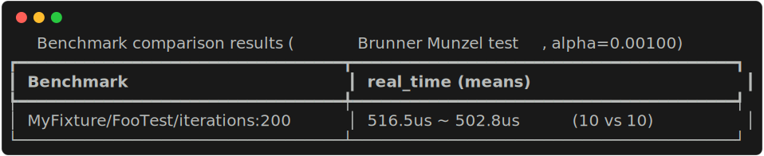
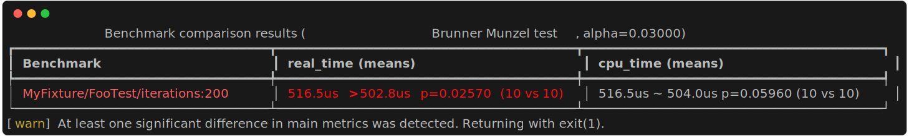
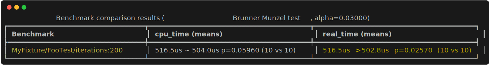
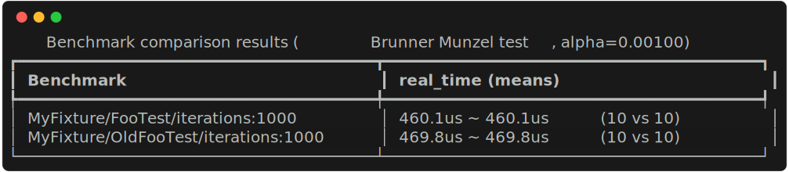
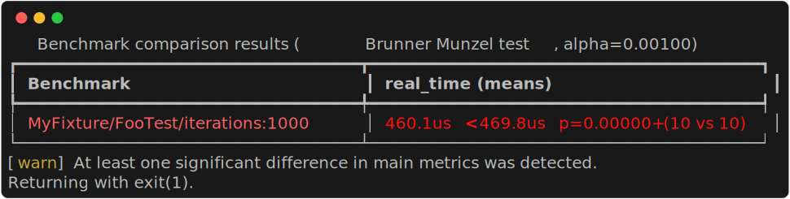

# Statistical testing for benchmark results comparison

`benchstats` is a Python 3.10+ package that lets you compare two sets of benchmark results<sup>*</sup> using proper statistical tests and make a readable report on that. This lets remove guesswork and WAGs from interpretation of benchmarking results, and obtain a solid<sup>**</sup> answer to a question "is the algorithm implementation A is faster than the algorithm implementation B".

Code that read input data, perform statistical testing and then visualize results is coupled only by a shared data types and it could easily be used separately if needed (for example, to build a performance regression testing pipeline).

<sup>*</sup> - while currently `benchstats` has a built-in parser only for [Google Benchmark](https://github.com/google/benchmark)-produced `.json` files, it's very simple to make and use a parser for any other data source as long as you know how to interpret it. See a "Custom data sources" paragraph and `--files_parser` CLI argument below.

<sup>**</sup> - the solidness of the answer still depends heavily on how well the underlying hardware and OS are quiesced, and how inherently non-deterministic the algorithms under benchmark are. It isn't covered here how to achieve these benchmarking basics, however, `benchstats` does have a mode to alleviate testing if the benchmarking machine is stable enough, see `--expect_same` CLI argument below.

## Rationale: why should you even bother to use statistical tests to compare benchmarking results?

\- *Really, why bother? Can't you just measure and compare the run time of code variant A to the run time of code variant B?*

Well, you can, but to see that this is meaningless, just run your benchmark several times. The numbers will never be the same, they'll fluctuate. Which particular number should you use for the comparison then?

\- *Ok, then why not take an average number over a certain amount of benchmark executions and compare these averages?*

If you repeat that experiment several times, you'll see this suffers from the very same problem as above - the number you get still fluctuates, even though usually it fluctuates less. You'll obtain two such numbers for benchmark alternatives and one will be bigger then the other. How would you know that the difference is large enough to be attributed to real differences in the code instead of a random non-determinism?

\- *Ah, but that's simple! In addition to the average value, also compute a standard deviation and then if averages are within 1-2-whatever standard deviations apart one from the other, declare the results aren't different. Otherwise one is significantly less or greater than the other. If you want to be extra sure, go with a "6 sigma golden standard" just like they do it in Physics! Google Benchmark even computes standard deviation on its own when you run benchmark with repetitions! Easy!*

... and even more wrong than you'd be, should you just compare two random measurements directly. [Standard deviation](https://en.wikipedia.org/wiki/Standard_deviation) is a measure of [variance](https://en.wikipedia.org/wiki/Variance) applicable (read: that make sense to apply) only to random variables that are instances of [Normal/Gaussian distribution](https://en.wikipedia.org/wiki/Normal_distribution). Measurements you get when benchmarking are anything but normally distributed, and a value computed as their "standard deviation" just doesn't describe what is expected - a real variance of distribution of measurements.

None of above is a good idea. But what is? Let's step back and think what do we want to learn from comparing benchmark results? We want to learn if a code variant A is faster, i.e. have smaller run time, than a code variant B. But we can't just measure their run times and compare them directly, because each measurement is essentially a random variable. Even if algorithms are perfectly deterministic, the hardware inherently isn't, so instead of measuring a run time precisely, we always sample a random value from some unknown distribution instead. Hence, the only correct way to go is to sample a lot of these random variables for distributions A and B, and then compare these sets of samples against each other. If it's more likely to find a smaller value in the set A than in the set B, then A is faster than B.

But how to do that? It's a well known problem in Mathematics and several solutions exists, such as [Mann–Whitney U test](https://en.wikipedia.org/wiki/Mann%E2%80%93Whitney_U_test) and a newer more generic [Brunner Munzel Test](https://en.wikipedia.org/wiki/Brunner_Munzel_Test). `benchstats` is essentially a convenience wrapper around these tests with fully customizable inputs and results visualization/exporting, letting you get the answers effortlessly.

## Examples of benchmark comparison

*(I'll use a Google Benchmark-derived binary as a data source for the examples, but just reminding that any data source could be easily plugged-in and used instead. For conciseness, I'll shorten "Google Benchmark" to simply "GBench")*

Note that in all cases, you should run at least 10 repetitions of a benchmark (`--benchmark_repetitions=10`). Even 2 repetitions would work, but the more data you have, the more reliable results are, and at least 10 is a reasonable minimum. `--benchmark_enable_random_interleaving` flag is highly recommended too.

Lets consider two use-cases to illustrate how to use `benchstats`.

### How to compare two different implementations of the same benchmark?

For example, you already have a benchmark in the `main` code branch and want to ensure that a `feature` branch, which modifies some underlying code, doesn't contain unexpected performance regressions. How to do that?

1. Run the benchmark from the `main` branch with `--benchmark_out=./my_main.json` argument to save results to `./my_main.json` file:

```bash
benchmark_binary --benchmark_repetitions=10 \
    --benchmark_enable_random_interleaving \
    --benchmark_out=./my_main.json
```

2. Checkout the `feature` code branch and similarly run the same benchmark saving results to `./my_feature.json` file.

3. Let the `benchstats` analyze the results:

```bash
python -m benchstats ./my_main.json ./my_feature.json real_time
```

The first two positional arguments of `benchstats` module are just file paths and the third argument is a json field name that contain a metric value for comparison. (`real_time` is the default field/metric, so it doesn't even have to be specified, btw). GBench typically saves two metrics: `real_time` (shown as just `Time` in reports) which is an average time of one iteration, and a `cpu_time` (shown as `CPU` in reports) which is an average time CPU spent executing the user-mode code. GBench also supports custom timers, and you can use them here as well. Typically, custom timers have the same field name as the name that was given to a counter (in case of doubts, just peek into a `.json` file).

If the `benchmark_binary` had only a single benchmark, the result of the command could look something like this:



`benchstats` present results as a table: the first column correspond to a benchmark name and all other columns shows results of applying a statistical test to a corresponding metric (yes, you can supply many metrics at once and all of them will be analyzed. Try to append `cpu_time` to the command line above).

Here's what a data cell of the `real_time` column mean: there were 10 samples of an alternative A (from the first positional argument - `my_main.json`) and 10 samples of an alternative B (from the second positional argument `my_feature.json`), - hence this `(10 vs 10)` text in the end. Mean value (hence `(means)` in the column title) for alternative A over its 10 samples was 516.5 microseconds, while mean for B was 502.8 microseconds. The test was using significance level 0.001 (hence the string `alpha=0.00100` in the table title) and on that level test declared that both sets aren't different from each other (hence symbol `~` between the mean values). Actual [p-value](https://en.wikipedia.org/wiki/P-value) for tests that didn't find a difference is not shown by default, only blank space is allocated to report it (so no text shift happens when some benchmark has differences and others don't) but you can pass `--always_show_pvalues` flag to show it.

To show how `benchstats` report could look like when a significant difference is found, I'll just rerun the same analysis with less restrictive significance level (and will use the opportunity to show effects of some above-mentioned flags)

```bash
python -m benchstats ./my_main.json ./my_feature.json real_time cpu_time \
    --always_show_pvalues --alpha=0.03
```



The main change is that now the test reports that according to `real_time` metric, the benchmark that generated `./my_main.json` run significantly slower than the benchmark that made `./my_feature.json`. Due to that the script has exited with exit code 1, letting one to detect that a human intervention might be needed. But what are these "main metrics" that the warning string refers to? Main metrics are such metrics, any difference in which makes the script to exit with error code 1. By default, a metric mentioned the first in the command line list of metrics is the main metric, but this could be changed with `--main_metrics` argument, which accepts a list of indices in the metrics list. Let's make `cpu_time` the main metric and see what would change:

```bash
python -m benchstats ./my_main.json ./my_feature.json real_time cpu_time \
    --always_show_pvalues --alpha=0.03 --main_metrics 1
```



Now `cpu_time` is the main metric and the difference in it isn't significant. `real_time` now is a secondary metric, which is only reported, but doesn't influence the script exit code.

### How to compare two different benchmarks against each other?

For example, we are optimizing a function and want to compare how a new implementation compares to the old. We've created an individual benchmark for both implementations and for convenience have placed them in the same binary. That implies the benchmark functions must have different names. Now, if we run the benchmark binary and obtain `./my.json` results file and then will follow the approach above blindly, we won't get what we need. `benchstats` compares a benchmark from the source 1 to a benchmark with the same name in the source 2, so we'll end up comparing old vs old in one row, and new vs new in the other, just like this:

```bash
python -m benchstats ./my.json ./my.json real_time
```


To solve that, `benchstats` has two features based on the Python standard [regular expression](https://docs.python.org/3.10/library/re.html#regular-expression-syntax) engine:

1. filtering benchmarks by name when reading a source file using a regexp in `--filter1` or `--filter2` flags correspondingly.
2. a benchmark name rewrite feature, based on regexp search and replace. `--from` (also `--from1` for source 1 only and `--from2` for source 2 only) flag sets a regular expression pattern to find in each benchmark name, and an optional `--to` (also `--to1` and `--to2`) flag sets replacement string to substitute the pattern found.

This allows us to make a plan:

1. source 1 will represent the new implementation. For that we'll read `./my.json` and take only benchmark names that doesn't have `Old` substring using a regexp `^(?!.*?Old).*$`
2. source 2 will represent the old implementation. We'll read `./my.json` and take only benchmarks with names that contain `Old` substring. The regexp is trivial literal string `Old`.
3. For source 2 we'll rewrite benchmark names to remove the `Old` prefix

```bash
python -m benchstats ./my.json ./my.json real_time \
    --filter1='^(?!.*?Old).*$' --filter2=Old \
    --from2='(?:Old)(.*?)' --to2=\\1
```

Note the single `'` quotes around `--filter1` and `--from2` regexps. They contain special characters that bash will try interpret spawning an error, if we won't escape them. Single quotes prevent bash expansion (double quotes `"` don't!) and pass strings as is to the program. Also note that string replacement pattern for `--to2` has a back slash escaped for that very reason too: `\\1` instead of `\1`. Single quotes is an option here too.

Now we get a proper result:



## Custom data sources


